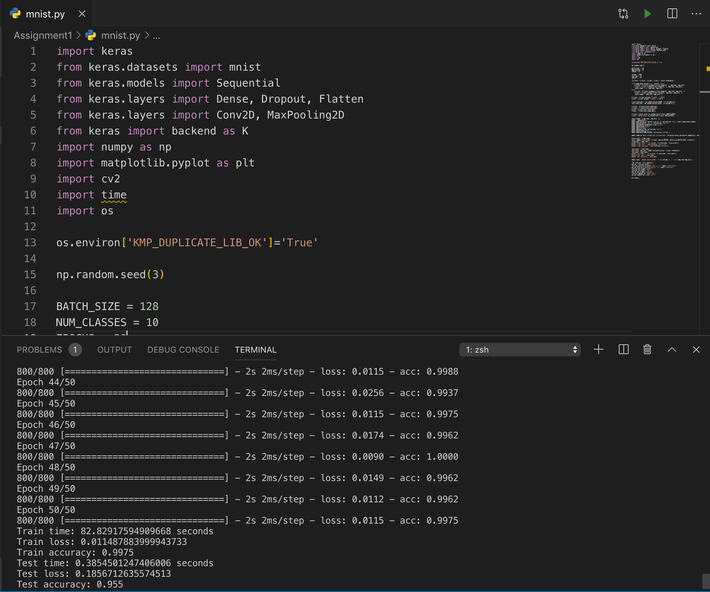

## Problem1.1 Comparing TensorFlow Trained CNN classifier with varying dataset complexity

### (1) URL of open source package
- Mnist cnn example in Keras documentation ([https://keras.io/examples/mnist_cnn/](https://keras.io/examples/mnist_cnn/))
- sample code in Advanced DNN Software in canvas

### (2) Example screen shots of the execution process/environment

I used Python3.5 and Keras on Mac OSX.

### (3) Input Analysis

#### (a) the input dataset

|   | size | resolution | storage size per image | storage size of dataset |
| :-: | :-: | :-: | :-: | :-: |
| MNIST | 1000 | 28\*28 | 0.8KB | 0.78MB  |
| MNIST | 1000 | 64\*64 | 4KB | 3.9MB |
| MNIST | 10000 | 28\*28  | 0.8KB | 7.8MB |
| MNIST | 10000 | 64\*64 | 4KB | 39.1MB |
| CIFAR10 | 1000 | 32\*32 | 3KB | 2.9MB |
| CIFAR10 | 1000 | 64\*64 | 12KB | 11.7MB |
| CIFAR10 | 10000 | 32\*32 | 3KB | 29.3MB |
| CIFAR10 | 10000 | 64\*64 | 12KB | 117.2MB |

### (4) Output Analysis
