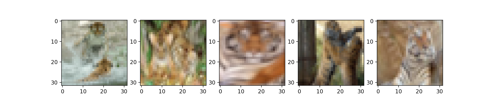

## Problem1.1 Comparing TensorFlow Trained CNN classifier with varying dataset complexity

To fully compare CNN classfier with varying datasets complexity, I choose the MNIST(grayscale images) and CIFAR10(color images) as my two domains and extract 3 datasets with different size and resolutions from each domain. Both two domains are classification tasks with 10 classes.

### (1) URL of open source package
- MNIST cnn example in Keras documentation ([https://keras.io/examples/mnist_cnn/](https://keras.io/examples/mnist_cnn/))
- CIFAR10 cnn exmaple in Keras documentation [https://keras.io/examples/cifar10_cnn/](https://keras.io/examples/cifar10_cnn/))
- sample code in Advanced DNN Software in canvas

### (2) Example screen shots of the execution process/environment

#### Environment Installation

- Python3.5
- Under the 'Assignment1' directry, run command ```pip3 install requirements.txt``` to install packages like tensorflow, keras, numpy, matplotlib and opencv.
- under the 'Assignment1' directory, run commands: ```python3 mnist.py``` or ```python3 cifar10.py```

#### Execution Process


### (3) Input Analysis

#### (a) the input dataset

|   | size | resolution | storage size per image | storage size of dataset |
| :-: | :-: | :-: | :-: | :-: |
| MNIST | 1000 | 28\*28  | 0.8KB | 0.75MB |
| MNIST | 1000 | 64\*64 | 4KB | 3.91MB |
| MNIST | 10000 | 28\*28 | 0.8KB | 7.48MB |
| CIFAR10 | 1000 | 32\*32 | 3KB | 2.93MB |
| CIFAR10 | 1000 | 64\*64 | 12KB | 11.72MB |
| CIFAR10 | 10000 | 32\*32 | 3KB | 29.30MB |

#### (b) five sampel images in two resolution versions

- MNIST (28\*28, 64\*64)


- CIFAR10 (28\*28, 64\*64)


- FASHION-MNIST (Outlier Test for MNIST) (28\*28, 64\*64)


- CIFAR100 (Outlier Test for CIFAR10) (32\*32, 64\*64)




#### (c) the training v.s. testing data split ratio and size used in my CNN training.

The training:testing data split ratio is 8:2. 

If dataset size is 1000, 80 images for training and 20 images for testing.

If dataset size is 10000, 800 images for training and 200 images for testing.

#### (d) Model configurations

- For the MNIST CNN model

|   | Layer | Hyper-parameters |
| :-: | :-: | :-: | :-: |
| 1 | Conv2D | filters=32, kernel_size=(3, 3), activation='relu' |
| 2 | Conv2D | filters=64, (3, 3), activation='relu' |
| 3 | MaxPooling2D | pool_size=(2, 2), dropout=0.25 |
| 4 | Dense | units=128, activation='relu', dropout=0.5 |
| 5 | Dense | units=10, activation='softmax' |

Min-batch size is 128, #epoch is 30.

- For the CIFAR10 CNN model

|   | Layer | Hyper-parameters |
| :-: | :-: | :-: | :-: |
| 1 | Conv2D | filters=32, kernel_size=(3, 3), activation='relu' |
| 2 | Conv2D | filters=32, (3, 3), activation='relu' |
| 3 | MaxPooling2D | pool_size=(2, 2), dropout=0.25 |
| 4 | Conv2D | filters=64, (3, 3), activation='relu' |
| 5 | Conv2D | filters=64, (3, 3), activation='relu' |
| 6 | MaxPooling2D | pool_size=(2, 2), dropout=0.25|
| 7 | Dense | units=512, activation='relu', dropout=0.5 |
| 8 | Dense | units=10, activation='softmax' |

Min-batch size is 32, #epoch is 100.


#### (e) Default error threshold

- For MNIST CNN model, the error threshold is 

- For CIFAR10 CNN model, the error threshold is

### (4) Output Analysis

#### (a) Model comparision (b) trained model size

|   | train accuracy | train time | test accuracy | test time | trained model size |
| :-: | :-: | :-: | :-: | :-: | :-: |
| MNIST-1000-28\*28 | 0.9925 | 57.44s | 0.9650 | 0.44s | 10.1MB |
| MNIST-1000-64\*64 | 0.9875 | 308.71s | 0.9400 | 0.99s | 52MB |
| MNIST-10000-28\*28 | 0.9954 | 542.59s | 0.9865 | 1.49s | 10.1MB |
| CIFAR10-1000-32\*32 | 0.7625 | 274.57s | 0.4550 | 0.63s | 14.4MB |
| CIFAR10-1000-64\*64 | 0.9875 | 1193.87s | 0.4300 | 1.09s | 88.7MB |
| CIFAR10-10000-32\*32 | 0.8716 | 2816.18s | 0.6510 | 2.13s | 14.4MB |

#### (c) Test results for outlined dataset

- Outlier test results for MNIST

I used the images from Fashion-MNIST and the ground truth of my outlier images is "pant".

|  Model | test1 | test2 | test3 | test4 | test5 | test6 | test7 | test8 | test9 | test10 |
| :-: | :-: | :-: | :-: | :-: | :-: | :-: | :-: | :-: | :-: | :-: |
| MNIST-1000-28\*28 | 4 | 1 | 4 | 6 | 7 | 7 | 6 | 7 | 1 | 6 |
| MNIST-1000-64\*64 | 6 | 6 | 6 | 6 | 6 | 6 | 6 | 7 | 1 | 6 |
| MNIST-10000-28\*28 | 4 | 7 | 0 | 1 | 4 | 1 | 8 | 4 | 1 | 4 |

- Outlier test results for CIFAR10

I used the images from CIFAR100 and the ground truth of my outlier images is "tiger"

The ground truth is "tiger"

|  Model | test1 | test2 | test3 | test4 | test5 | test6 | test7 | test8 | test9 | test10 |
| :-: | :-: | :-: | :-: | :-: | :-: | :-: | :-: | :-: | :-: | :-: |
| CIFAR10-1000-32\*32 | 2 | 4 | 4 | 5 | 2 | 2 | 6 | 7 | 3 | 6 |
| CIFAR10-1000-64\*64 | 4 | 2 | 3 | 5 | 2 | 2 | 7 | 7 | 6 | 6 |
| CIFAR10-10000-32\*32 | 3 | 4 | 3 | 3 | 3 | 5 | 6 | 5 | 6 | 6 |

#### (d) My observations
1. hjhh
2. hhhh
