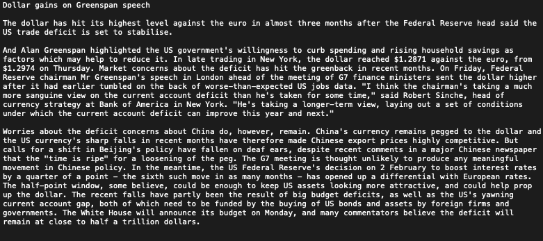
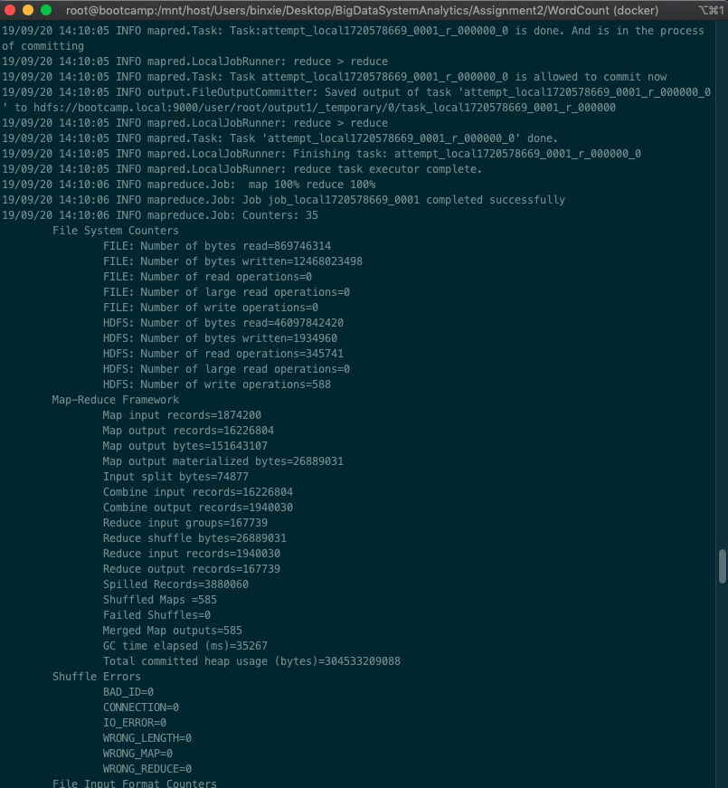
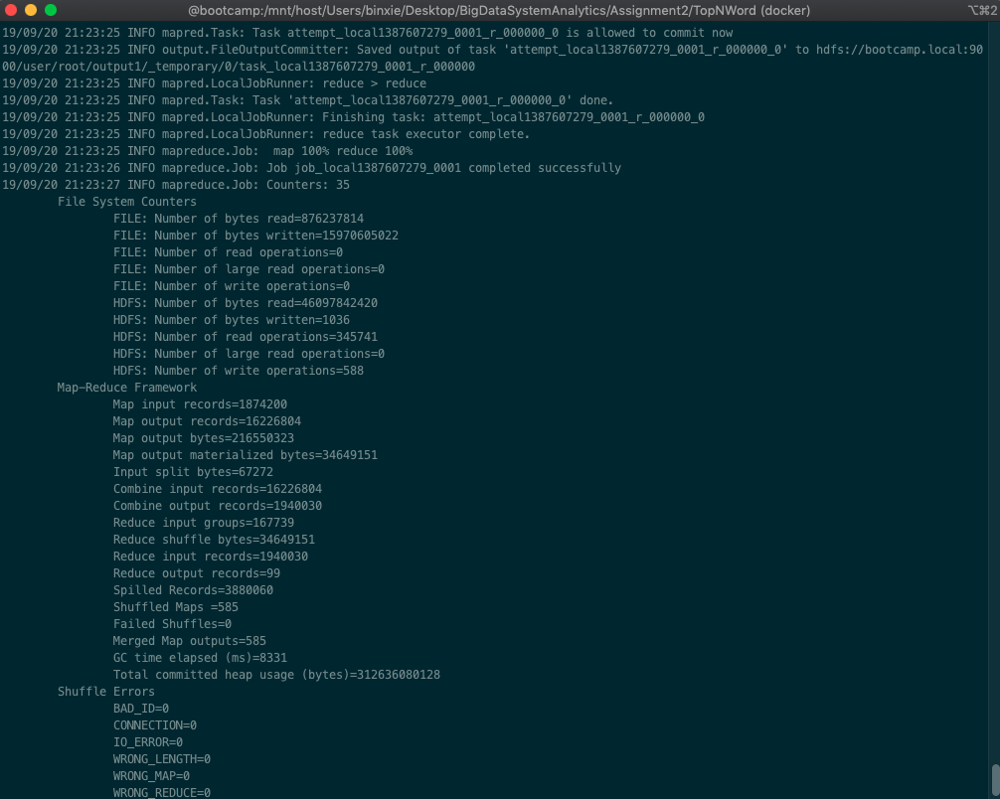
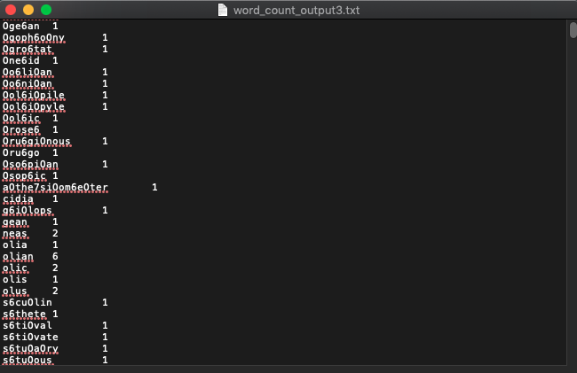
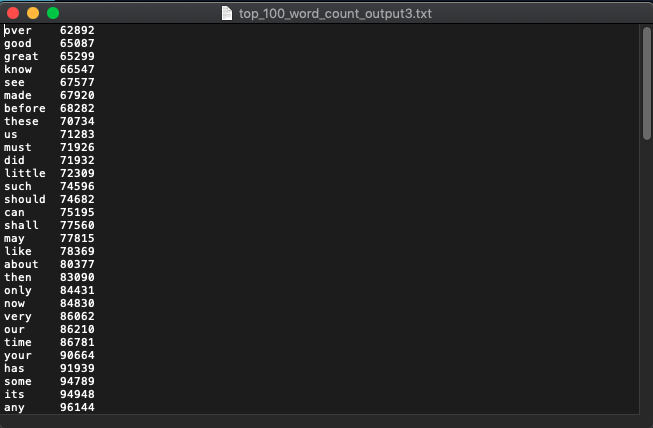

## Problem1.1 and 1.2 Learning and Comparing Hadoop MapReduce with Spark MapReduce

### Introduction

For this assignment, my two scenorios are Word Count and Top 100 Words in most files.

For the input dataset, I use Classic Literature in ASCII datasets. 

To explore the scaling effect and the performance of Hadoop MapReduce and Spark MapReduce, I will run two programs with datasets in different sizes on both Hadoop MapReduce and Spark MapReduce.


### Dataset

For the input data, I choose the [Classic Literature in ASCII dataset](https://www.kaggle.com/mylesoneill/classic-literature-in-ascii) on Kaggle. This dataset is a small subset from TEXTFILES.COM, which is a website by Jason Scott dedicated to collecting and preserving text files from this internet of the past, focussing exclusively on english literary works.

There are 1100 books in this dataset and the size is 351.7MB. In this assignment, I create 3 datasets with size 94MB, 212MB and 351.7MB.

Here is a document sample:



### Environment
- Mac OSX
- Docker
- Hadoop 2.7.3
- Spark 2.1.0

### Execution Instructions

Codes for Word Count problem are in the "WordCount" directory.

Codes for top 100 words problem are in the "TopNWord" directory.

For each problem, the development process for Hadoop MapReduce is as follows:

1\. **Code**: write the MapReducer codes in java file

2\. **Compile**: compile the Java files with javac

```
mkdir classes
javac -cp $(hadoop classpath) -d classes <filename>.java
```

3\. **Create JAR**: create the Jar using classes just compiled

```
jar -cvf <filename>.jar -C classes/ .
```

4\. **Run**: create the "input" directory in HDFS, upload all the text files into "input" directory and run the Jar to process the data

```
hadoop jar WordCount.jar WordCount input output

hadoop jar TopKWordCount.jar TopKWordCount input output 100
```

5\. **Download output**: merge the output files in HDFS and download it to local machine

```
hdfs dfs -getmerge output <filename>.txt
```

### Execution Process

Execution screenshot for Word Count



Execution screenshot for Top 100 Word Count



### Output

Here are two samples of output for Word Count and Top 100 Words.





### Runtime measurements analysis

### Conclusions