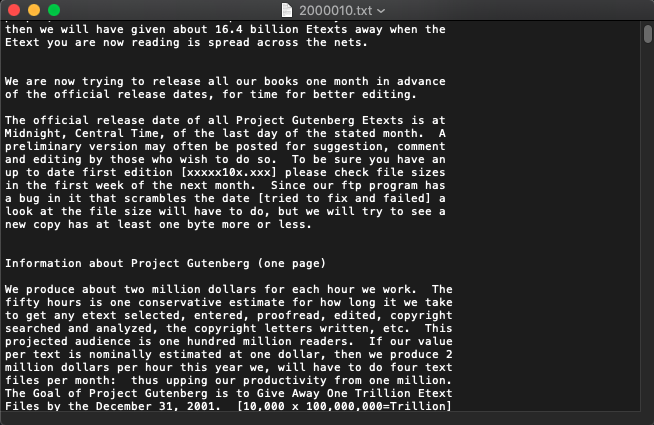

## Problem1.1 and 1.2 Learning and Comparing Hadoop MapReduce with Spark MapReduce

### Introduction

For this assignment, my two scenorios are Word Count and Top 100 Words in most files.

For the input dataset, I use BBC datasets which includes 2225 documents. 

To explore the scaling effect and the performance of Hadoop MapReduce and Spark MapReduce, I will run two programs with datasets in different sizes on both Hadoop MapReduce and Spark MapReduce.


### Dataset

For the input data, I choose the articles from the BBC news website corresponding to stories in five topical areas from 2004-2005 from [BBC Datasets](http://mlg.ucd.ie/datasets/bbc.html).

There are totally 2225 documents and the size is 9.8MB. For the experiment, I will run programs on 500, 1000, 1500 and 2000 documents.

Here is a document sample:



### Environment
- Mac OSX
- Hadoop 2.7.3
- Spark 2.1.0

### Execution Instructions

Codes for Word Count problem are in the "WordCount" directory.

Codes for top 100 words problem are in the "TopNWord" directory.

For each problem, the development process for Hadoop MapReduce is as follows:

1\. **Code**: write the MapReducer codes in java file

2\. **Compile**: compile the Java files with javac

```
mkdir classes
javac -cp $(hadoop classpath) -d classes WordCount.java
```

3\. **Create JAR**: create the Jar using classes just compiled

```
jar -cvf WordCount.jar -C classes/ .
```

4\. **Run**: create the "input" directory in HDFS, upload all the text files into "input" directory and run the Jar to process the data

```
hadoop jar WordCount.jar WordCount input output
```

5\. **Download output**: merge the output files in HDFS and download it to local machine

```
hdfs dfs -getmerge output word_count_output.txt
```

### Execution Process


### Runtime measurements

### Reference

[1] D. Greene and P. Cunningham. "Practical Solutions to the Problem of Diagonal Dominance in Kernel Document Clustering", Proc. ICML 2006.