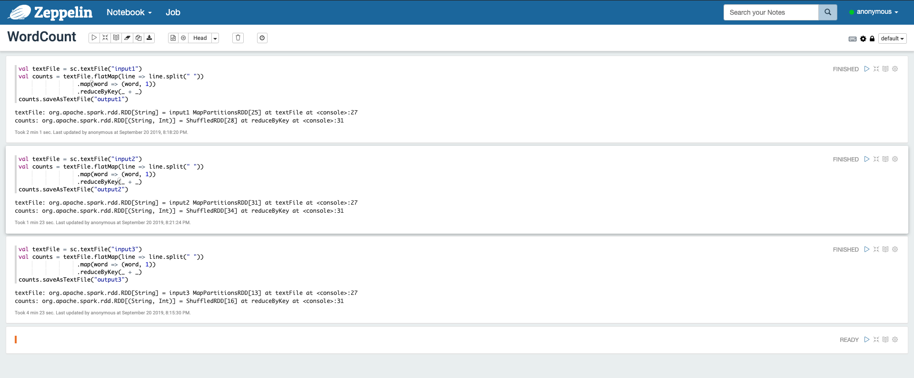

## Problem1.1 and 1.2 Learning and Comparing Hadoop MapReduce with Spark MapReduce

### Introduction

For this assignment, my two scenorios are Word Count and Top 100 Words in most files.

For the input dataset, I use Classic Literature in ASCII datasets. 

To explore the scaling effect and the performance of Hadoop MapReduce and Spark MapReduce, I will run two programs with datasets in different sizes on both Hadoop MapReduce and Spark MapReduce.

All the source codes and output are on the github: [https://github.com/LazyIce/BigDataSystemAnalytics/tree/master/Assignment2](https://github.com/LazyIce/BigDataSystemAnalytics/tree/master/Assignment2)

### Dataset

For the input data, I choose the [Classic Literature in ASCII dataset](https://www.kaggle.com/mylesoneill/classic-literature-in-ascii) on Kaggle. This dataset is a small subset from TEXTFILES.COM, which is a website by Jason Scott dedicated to collecting and preserving text files from this internet of the past, focussing exclusively on english literary works.

There are 1100 books in this dataset and the size is 351.7MB. In this assignment, I create 3 datasets with size 94MB, 212MB and 351.7MB.

Here is a document sample:


### Environment
- Mac OSX
- Docker
- Hadoop 2.7.3
- Spark 2.1.0
- Zeppelin

### Execution Instructions

Codes for Word Count problem are in the "WordCount" directory.

Codes for top 100 words problem are in the "TopNWord" directory.

#### Hadoop MapReduce:

1\. **Code**: write the MapReducer codes in java file

2\. **Compile**: compile the Java files with javac

```
mkdir classes
javac -cp $(hadoop classpath) -d classes <filename>.java
```

3\. **Create JAR**: create the Jar using classes just compiled

```
jar -cvf <filename>.jar -C classes/ .
```

4\. **Run**: create the "input" directory in HDFS, upload all the text files into "input" directory and run the Jar to process the data

```
# for Word Count
hadoop jar WordCount.jar WordCount input output

# for Top 100 Word Count
hadoop jar TopKWordCount.jar TopKWordCount input output 100
```

5\. **Download output**: merge the output files in HDFS and download it to local machine

```
hdfs dfs -getmerge output <filename>.txt
```

#### Spark MapReduce
For the spark part, I run the codes by Spark and Zeppelin. The source codes exporting from Zeppelin are in the JSON file.


### Execution Process

Execution screenshot for Word Count through Hadoop MapReduce


Execution screenshot for Word Count through Spark MapReduce



### Output

Here are two samples of output for Word Count and Top 100 Words.


### Runtime measurements analysis

In the console log, it's said that I can access localhost:8080 to track the job. Here, I export the port 8080 out from my docker to my host port 8080 and get the docker container ip. However, I still can't open the <docker container ip>:8080 in my browser. After I searched online, it's said that this is the bug in the hadoop image which is not solved. Therefore, I use the linux "time" command to evaluate the runtime.

|  Senario |  Platform  | 94MB data | 212MB data | 351.7MB data
|  ----  | ----  |  ----  | ----  | ---- |
| Word Count  | Hadoop | 1m35s | 2m27s | 4m19s
| Top 100 Word Count  | Hadoop | 	1m46s | 2m54s | 6m1s
| Word Count  | Spark | 1m1s | 1m36s | 4m23s
| Top 100 Word Count  | Spark | 1m16s | 1m23s | 3m4s


Based on the above results, we can observe that with the increasement of the data size, the runtime for hadoop mapreduce increases. However, the speed of runtime increasement is not so quick as data size increament. It shows that hadoop mapreduce has good scalability.

Also, we can found that Word Count and Top 100 Word Count don't have great difference in runtime on each dataset. Only for the dataset with 351.7MB size, the Top 100 Word Count takes about two more minutes than Word Count. I think this may because Top 100 Word Count do more sorting calculations for large dataset.

When it comes to Spark, we can observe that the runtime of Spark MapReduce also increases when the dataset gets larger. However, for dataset with size 94MB and 212MB, runtimes for both Word Count and Top 100 Word Count have little difference. It may because that for spark, most time is used for I/O and serialization. And when the datset is not too large, the time for I/O and serialization is similar.

Comparing the Hadoop MapReduce and Spark MapReduce:

- When coding, I can feel that some problems aren’t easily described as map-reduce
extend the MapReduce model. The codes for Spark MapReduce are more concise and easy than Hadoop MapReduce to solve the same problem.

- Based on the results, to solve the same problem with same dataset, Spark MapReduce takes less time than Hadoop MapReduce. As we learned in class, Spark has only one time disk R/W, majority of processing is done in memory. This is the reason that Spark spends less time for calculation. However, there is an exception in Word Count that Spark MapReuce takes more time than Hadoop MapReduce with 351.7MB dataset. I think it may be caused by that Spark takes more time for I/O and serialization of these 351.7MB dataset.

- However, we can also found that the time difference is really small between Hadoop and Spark in my experiments. Here, to choose Hadoop or Spark to solve the problem is really a tradeoff. For some easy case with really larget dataset, Hadoop may be a better choice. For one reason, Spark users are required to know that memory they have is sufficient for the dataset and in-memory extention is more expensive. For another, Hadoop is sufficient to solve easy calculation. However, for some complicated case with large dataset, Spark is a better choice since Spark has faster calculation speed and can support more functions to solve difficult problem. 